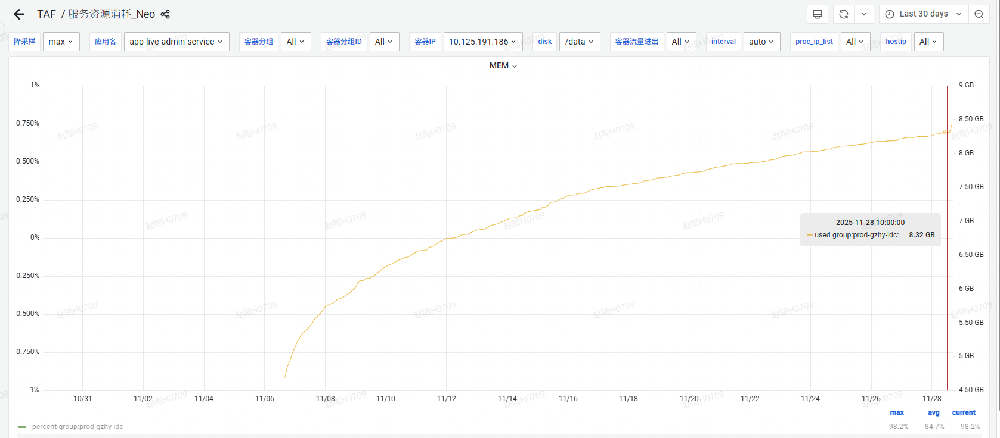
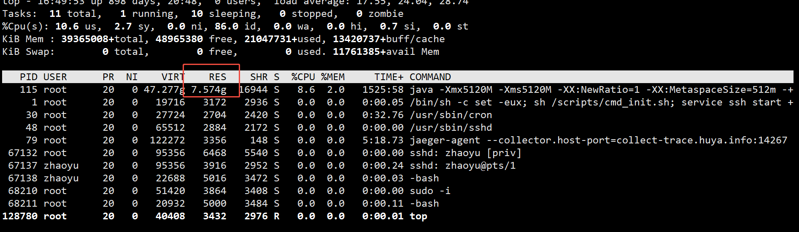

# problem


* problem: the java process is using more and more memory over time.
* jvm argument:java -Xmx5120M -Xms5120M -XX:NewRatio=1 -XX:MetaspaceSize=512m -XX:MaxMetaspaceSize=512m -XX:+HeapDumpOnOutOfMemoryError -XX:HeapDumpPath=/data/log -XX:+PrintCommandLineFlags -XX:+PrintGCDetails -XX:+PrintGCDateStamps -XX:+PrintGCTimeStamps -Xloggc:/data/log/gc-%t.log -XX:+UseGCLogFileRotation -XX:NumberOfGCLogFiles=5 -XX:GCLogFileSize=20m -XX:ErrorFile=/data/log/hs_err_%p.log -XX:+UseConcMarkSweepGC -XX:CMSInitiatingOccupancyFraction=80 -XX:+UseCMSInitiatingOccupancyOnly -XX:AutoBoxCacheMax=20000 -XX:-UseBiasedLocking -XX:NativeMemoryTracking=detail -jar /data/app/app-live-admin-service/app_live_admin_services.jar

* cggroup memory info:
```declarative
root@app-live-admin-service-prod-gzhy-idc-1283210-ml75f:~#  cat /sys/fs/cgroup/memory/memory.usage_in_bytes
8418189312
root@app-live-admin-service-prod-gzhy-idc-1283210-ml75f:~# cat /sys/fs/cgroup/memory/memory.limit_in_bytes
8589934592
root@app-live-admin-service-prod-gzhy-idc-1283210-ml75f:~# cat /sys/fs/cgroup/memory/memory.stat
cache 99835904
rss 8128270336
rss_huge 0
shmem 0
mapped_file 2162688
dirty 0
writeback 5406720
pgpgin 145263294
pgpgout 143253713
pgfault 1201709916
pgmajfault 0
inactive_anon 0
active_anon 8128462848
inactive_file 91987968
active_file 6205440
unevictable 0
hierarchical_memory_limit 8589934592
total_cache 99835904
total_rss 8128270336
total_rss_huge 0
total_shmem 0
total_mapped_file 2162688
total_dirty 0
total_writeback 5406720
total_pgpgin 145263294
total_pgpgout 143253713
total_pgfault 1201709916
total_pgmajfault 0
total_inactive_anon 0
total_active_anon 8128462848
total_inactive_file 91987968
total_active_file 6205440
total_unevictable 0
```

* jcmd GC heap info:
```declarative
root@app-live-admin-service-prod-gzhy-idc-1283210-ml75f:~# jcmd 115 GC.heap_info
115:
 par new generation   total 2359296K, used 406730K [0x00000006a0800000, 0x0000000740800000, 0x0000000740800000)
  eden space 2097152K,  18% used [0x00000006a0800000, 0x00000006b8266b70, 0x0000000720800000)
  from space 262144K,   7% used [0x0000000730800000, 0x0000000731acbd30, 0x0000000740800000)
  to   space 262144K,   0% used [0x0000000720800000, 0x0000000720800000, 0x0000000730800000)
 concurrent mark-sweep generation total 2621440K, used 362690K [0x0000000740800000, 0x00000007e0800000, 0x00000007e0800000)
 Metaspace       used 180048K, capacity 196318K, committed 196608K, reserved 1224704K
  class space    used 19486K, capacity 22194K, committed 22272K, reserved 1048576K
```

* heap_info
```declarative
Attaching to process ID 115, please wait...
Debugger attached successfully.
Server compiler detected.
JVM version is 25.412-b08

using parallel threads in the new generation.
using thread-local object allocation.
Concurrent Mark-Sweep GC

Heap Configuration:
   MinHeapFreeRatio         = 40
   MaxHeapFreeRatio         = 70
   MaxHeapSize              = 5368709120 (5120.0MB)
   NewSize                  = 2684354560 (2560.0MB)
   MaxNewSize               = 2684354560 (2560.0MB)
   OldSize                  = 2684354560 (2560.0MB)
   NewRatio                 = 1
   SurvivorRatio            = 8
   MetaspaceSize            = 536870912 (512.0MB)
   CompressedClassSpaceSize = 528482304 (504.0MB)
   MaxMetaspaceSize         = 536870912 (512.0MB)
   G1HeapRegionSize         = 0 (0.0MB)

Heap Usage:
New Generation (Eden + 1 Survivor Space):
   capacity = 2415919104 (2304.0MB)
   used     = 53123984 (50.66297912597656MB)
   free     = 2362795120 (2253.3370208740234MB)
   2.1989140245649548% used
Eden Space:
   capacity = 2147483648 (2048.0MB)
   used     = 31850616 (30.37511444091797MB)
   free     = 2115633032 (2017.624885559082MB)
   1.4831598848104477% used
From Space:
   capacity = 268435456 (256.0MB)
   used     = 21273368 (20.287864685058594MB)
   free     = 247162088 (235.7121353149414MB)
   7.924947142601013% used
To Space:
   capacity = 268435456 (256.0MB)
   used     = 0 (0.0MB)
   free     = 268435456 (256.0MB)
   0.0% used
concurrent mark-sweep generation:
   capacity = 2684354560 (2560.0MB)
   used     = 395406008 (377.0885543823242MB)
   free     = 2288948552 (2182.911445617676MB)
   14.73002165555954% used

85820 interned Strings occupying 9118248 bytes.

```

* nmt info
[detail see](nmt.txt)
```declarative
Native Memory Tracking:

Total: reserved=7532MB, committed=6442MB
-                 Java Heap (reserved=5120MB, committed=5120MB)
                            (mmap: reserved=5120MB, committed=5120MB) 
 
-                     Class (reserved=1202MB, committed=198MB)
                            (classes #29966)
                            (malloc=6MB #91853) 
                            (mmap: reserved=1196MB, committed=192MB) 
 
-                    Thread (reserved=632MB, committed=632MB)
                            (thread #629)
                            (stack: reserved=630MB, committed=630MB)
                            (malloc=1MB #3768) 
                            (arena=1MB #1253)
 
-                      Code (reserved=277MB, committed=191MB)
                            (malloc=34MB #42103) 
                            (mmap: reserved=244MB, committed=158MB) 
 
-                        GC (reserved=31MB, committed=31MB)
                            (malloc=16MB #2974) 
                            (mmap: reserved=15MB, committed=15MB) 
 
-                  Compiler (reserved=2MB, committed=2MB)
                            (malloc=2MB #4636) 
 
-                  Internal (reserved=155MB, committed=155MB)
                            (malloc=155MB #52511) 
 
-                    Symbol (reserved=31MB, committed=31MB)
                            (malloc=27MB #309643) 
                            (arena=4MB #1)
 
-    Native Memory Tracking (reserved=9MB, committed=9MB)
                            (malloc=1MB #9371) 
                            (tracking overhead=8MB)
 
-                   Unknown (reserved=73MB, committed=73MB)
                            (mmap: reserved=73MB, committed=73MB) 
 
Virtual memory map:
```